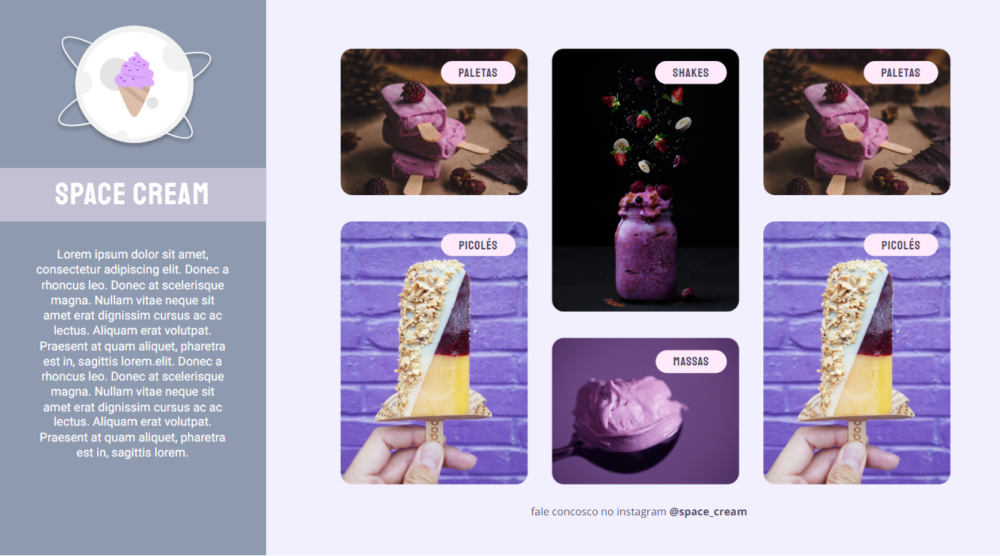
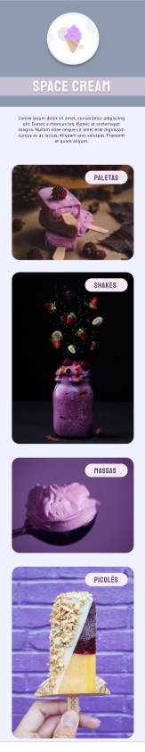

<h1 align="center">🍦 Space Cream</h1>

  

  

---

## 📖 Sobre o projeto
O **Space Cream** é uma página web fictícia para uma sorveteria temática espacial.  
Foi desenvolvida como exercício de **HTML5** e **CSS3**, explorando boas práticas de layout, responsividade e animações.

---

## 🚀 Tecnologias
Esse projeto foi construído com:
- **HTML5** → Estrutura da aplicação
- **CSS3** → Estilização, grid layout e animações
- **Google Fonts** (Staatliches, Palanquin, Roboto e Open Sans)
- **Git & GitHub** → Versionamento e hospedagem
- **Figma** → Protótipo do design

---

## 🎨 Layout e funcionalidades
- **Design Mobile First**  
- **Unidades flexíveis (rem)** para facilitar a responsividade  
- **CSS Grid e Flexbox** para organizar os cards de produtos  
- **Transições e animações** em hover e entrada dos elementos  
- **Paleta de cores em HSL e variáveis CSS** para consistência  
- **Imagens interativas** (zoom ao passar o mouse)  
- **Versão mobile e desktop diferenciadas**  

---

## 📂 Estrutura do projeto

---

## 🔗 Acesse online
👉 [Clique aqui para visualizar o projeto](https://jonatanfz.github.io/spacecream/)

---

## 📸 Pré-visualização
### 💻 Desktop

### 📱 Mobile

---

## 👨‍💻 Autor
Feito com 💙 por **Jonatan Fiuza** no programa da **Rocketseat** 🚀  
